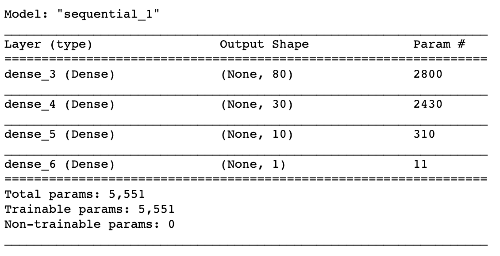

# Neural_Network_Charity_Analysis

## Overview
Alphabet soup is a philanthropic organization that raises and donates money to companies which help the environment, improve human well-being, and unify the world.

This project aims to building a deep learning model to predict whether or not organizations funded by Alphabet Soup use the money effectively. 

The model was built in Jupyter Notebook using scikit-learn and tensorflow.

## Results

### *Data Preprocessing*
The dataset in this project includes information about each organization that recieves funding from Alphabet Soup. 


The data can be separated as followed to build the deep learning model:

* Target Variable:
    * **IS_SUCCESSFUL** - Whether or not the money was used effectively

* Feature Variables:
    * **APPLICATION_TYPE** - Alphabet Soup application type
    * **AFFILIATION** - Affiliated sector of industry
    * **CLASSIFICATION** - Government organization classification
    * **USE_CASE** - Use case for funding
    * **ORGANIZATION** - Organization type
    * **STATUS** - Active status
    * **INCOME_AMT** - Income classification
    * **SPECIAL_CONSIDERATIONS** - Special considerations for application
    * **ASK_AMT** - Funding amount requested

* Variables to be Removed:
    * **EIN** - Identification column
    * **NAME** - Identification column

* Preparing the Data for Model Training:
    * *Binning:* Once the EIN and NAME columns were removed, the APPLICATION_TYPE and CLASSIFICATION values were binned to group infrequent value into a class labeled "Other".

    ```# Determine which values to replace if counts are less than ...?
    replace_application = list(application_counts[application_counts < 500].index)

    # Replace in dataframe
    for app in replace_application:
        application_df.APPLICATION_TYPE = application_df.APPLICATION_TYPE.replace(app,"Other")
    
    # Check to make sure binning was successful
    application_df.APPLICATION_TYPE.value_counts()
    ```

    * *Encoding:* Next the categorical columns (data type object) were encoded to numerical values so that the resulting DataFrame had all numeric values.

        

    * *Splitting and Scaling: Finally, the data was split into feature (X) and target (y) variables to create training and testing sets, and the X values were scaled using the StandardScaler() function.

### *Compiling, Training and Evaluating the Model*
* Model Parameters
    The initial model contained two hidden layers with 80 and 30 neurons per layer. The activation function used for the input and hidden layers was ReLu, while Sigmoid was used for the output layer:

    ```# Define the model - deep neural net, i.e., the number of input features and hidden nodes for each layer.
    number_input_features = len(X_train_scaled[0])
    hidden_nodes_layer1 = 80
    hidden_nodes_layer2 = 30

    nn = tf.keras.models.Sequential()

    # First hidden layer
    nn.add(tf.keras.layers.Dense(units=hidden_nodes_layer1, input_dim=number_input_features, activation="relu"))

    # Second hidden layer
    nn.add(tf.keras.layers.Dense(units=hidden_nodes_layer2, activation="relu"))

    # Output layer
    nn.add(tf.keras.layers.Dense(units=1, activation="sigmoid"))
    ```


    


* Target Model Performance
    * The model was trained for a total of 100 epochs, with a resulting accuracy 73.03%.

        

    * The target model performance is 75% accuracy. 

* Model Optimization
    * **First Attempt:**
        * To achieve the target model performance, we first reassessed the input variables to determine if additional columns could be removed. From this, we chose to remove the SPECIAL_CONSIDERATIONS and STATUS columns because only a few values in these columns were different from the majority:

            
            

        * We also changed the binning on the ORGANIZATION, AFFILIATION, and USE_CASE columns to group outlier values together. 

        * The model parameters were kept the same and the resulting accuracy was 73.12%, a slight improvement from the intial model:

            


    * **Second Attempt:**
        * Next we added an additional hidden layer with 10 neurons to the deep learning model and increased the number of epochs from 100 to 200:

            

        * The resulting model accuracy increased to 73.26%:

            


    * **Third Attempt:**
        * Since increasing the number of layers and epochs lead to a slight increase in model performance, we then increased the number of neurons in the second and third hidden layers to 50 and 20 respectively: 

            

        * The resuling model accuracy decreased to 72.97%.

            


    * **Fourth Attempt:**
        * In the final attempt at improving model performance, we returned to the same number of neurons from the second attempt, but this time changed the activation functions on the second and third hidden layers from ReLu to Tanh. The model trained for 200 epochs.

        * The resulting model accuracy was 73.13%.

            

## Summary
After attempting to optimize the original deep learning model, model performance remained the same at about 73% accuracy, meaning that the model could accurately predict whether an organization will use the funding from AlphabetSoup effectively 72-73% of the time. This did not reach our target model performance of 75% accuracy.

Increasing the number of neurons in the hidden layers seemed to negatively impact model performance, while modifying outliers via binning, removing additional variables from the training data, and adding additional hidden layers led to a slight boost in model performance. 

The best model performance was the Second Attempt at optimization, where the input data had been modified, an additional hidden layer had been added, and the number of training epochs had been doubled. 

To improve model performance a different model may be a more appropriate classifier for this dataset. In particular, a Random Forest Classifier may be more fitting because it can easily handle outliers and nonlinear data, meaning we could leave the outlier columns as-is and avoid losing potentially useful data. 


